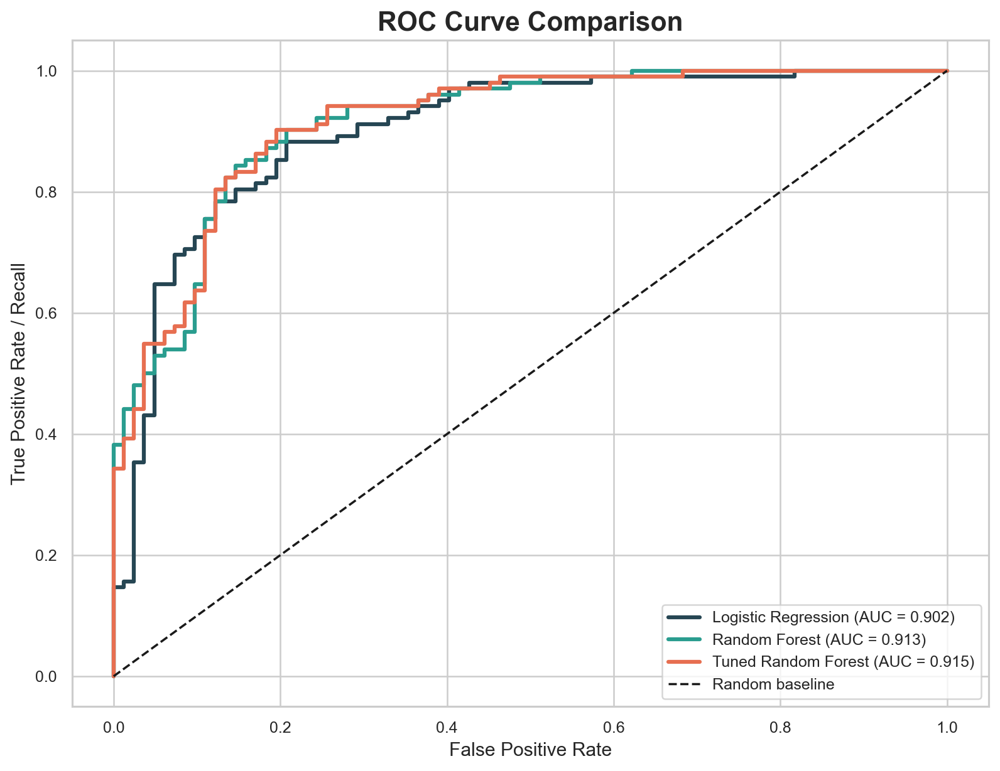
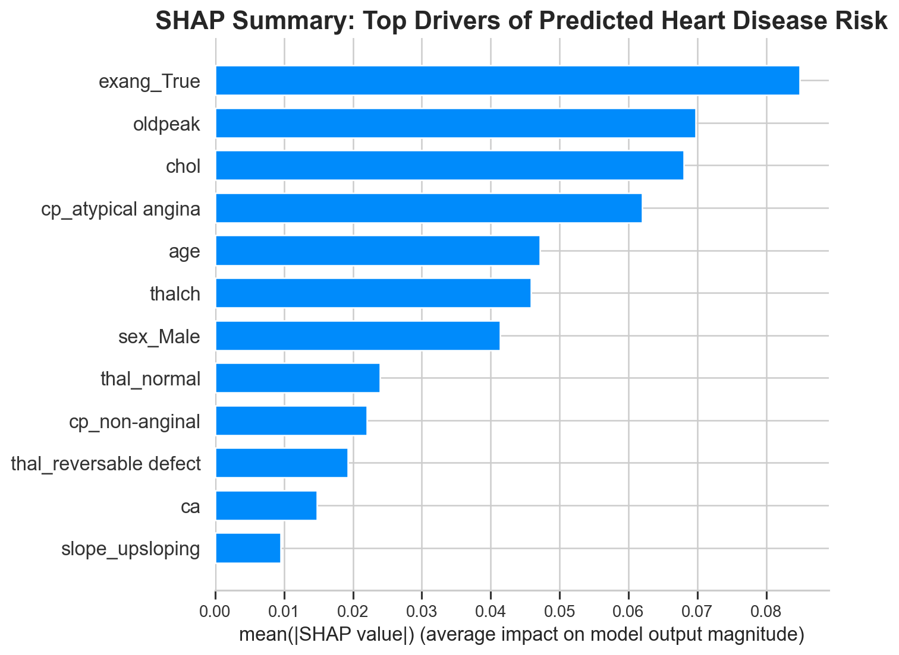

# Interpretable Heart Disease Risk Prediction


An interpretable machine learning project that predicts whether a patient shows evidence of heart disease from structured clinical measurements.

This project is designed as a recruiter-friendly ML portfolio case study: clear problem framing, readable preprocessing, strong evaluation, model comparison, ROC-AUC analysis, SHAP interpretability, and real-world healthcare limitations.

## Overview

The goal is to build a practical heart disease risk-screening model that can:

- Predict whether heart disease is present
- Compare interpretable baseline and tree-based models
- Evaluate performance beyond accuracy
- Explain which features influence predictions
- Provide a polished Streamlit dashboard for interactive risk estimation
- Discuss healthcare deployment risks responsibly

This is not a diagnostic system. It is a machine learning demonstration showing how a model could support risk prioritization with clinical oversight.

## Problem Statement

Given patient health features such as age, chest pain type, cholesterol, maximum heart rate, exercise-induced angina, and ST depression, predict whether heart disease is present.

The original UCI target `num` records disease severity. This project converts it into a binary target:

- `0`: no heart disease
- `1`: heart disease present (`num > 0`)

## Dataset

The dataset is the [UCI Heart Disease dataset](https://archive.ics.uci.edu/dataset/45/heart%2Bdisease), stored locally at:

```text
data/heart_disease_uci.csv
```

Project dataset shape:

```text
920 rows x 16 columns
```

The `id` column is excluded because it is only an identifier. The `dataset` column is excluded from modeling because it represents data source/site rather than patient health information.

## Models Used

Two model families are used:

- **Logistic Regression**: interpretable baseline with scaled numeric features
- **Random Forest**: nonlinear model that captures interactions and supports feature importance

The final model is a lightweight tuned Random Forest using `GridSearchCV`.

The workflow uses sklearn Pipelines for production-style preprocessing:

- Median imputation for numeric features
- Most-frequent imputation for categorical features
- One-hot encoding for categorical features
- Standard scaling for Logistic Regression
- Stratified train-test split and cross-validation

## Results

Held-out test set performance:

| Model | Accuracy | Precision | Recall | F1 | ROC-AUC |
|---|---:|---:|---:|---:|---:|
| Logistic Regression | 0.842 | 0.841 | 0.882 | 0.861 | 0.902 |
| Random Forest | 0.842 | 0.841 | 0.882 | 0.861 | 0.913 |
| Tuned Random Forest | 0.848 | 0.849 | 0.882 | 0.865 | 0.915 |

Tuned Random Forest best parameters:

```text
max_depth: 8
min_samples_leaf: 3
n_estimators: 200
```

5-fold cross-validation:

| Model | Mean Accuracy | Mean Recall | Mean F1 |
|---|---:|---:|---:|
| Logistic Regression | 0.826 | 0.855 | 0.844 |
| Random Forest | 0.823 | 0.857 | 0.842 |

Recall is especially important in this healthcare framing because a false negative means a patient with possible heart disease may be missed.

## Visual Examples

### ROC Curve



### SHAP Feature Summary



## Streamlit App

The project includes a polished Streamlit app that feels like a lightweight clinical dashboard.

The app provides:

- Patient feature inputs grouped by clinical category
- Tuned model risk prediction
- Risk score with color-coded interpretation
- Simple feature-level explanation
- Clear educational disclaimer

Run it locally with:

```powershell
streamlit run app.py
```

## ROC-AUC Discussion

ROC curves compare true positive rate against false positive rate across multiple classification thresholds. ROC-AUC summarizes this curve into one score.

This matters in healthcare because the threshold may change depending on the workflow. A screening tool may prefer higher recall to catch more possible disease cases, while a follow-up testing workflow may prefer higher precision to reduce false alarms.

## SHAP Interpretability

SHAP explains how much each feature pushes model predictions higher or lower for heart disease risk.

Top SHAP drivers in the tuned Random Forest include:

- Exercise-induced angina
- ST depression (`oldpeak`)
- Cholesterol
- Chest pain type
- Age
- Maximum heart rate

Feature importance ranks what the model uses most. SHAP goes further by showing direction and magnitude of impact, which is valuable for healthcare AI transparency.

## Key Insights

- The strongest model signals are clinically interpretable and align with cardiovascular risk indicators.
- Logistic Regression is a strong explainable baseline, while the tuned Random Forest slightly improves F1 and ROC-AUC.
- ROC-AUC above 0.90 suggests strong class separation on this held-out split.
- Threshold tuning is critical because lower thresholds improve recall but create more false positives.
- SHAP makes the model easier to discuss with non-technical stakeholders.

## Ethical Considerations

Healthcare ML systems require careful governance:

- **Bias:** A model trained on limited populations may not generalize fairly.
- **False negatives:** Missing true disease cases can delay care.
- **False positives:** Excessive alerts can create anxiety and unnecessary testing.
- **Data drift:** Patient populations and clinical practices change over time.
- **Privacy:** Patient data requires strict security and compliance controls.
- **Clinical oversight:** ML should assist clinicians, not replace diagnosis.

## Technologies Used

- Python
- pandas
- NumPy
- scikit-learn
- matplotlib
- seaborn
- SHAP
- Jupyter Notebook
- joblib
- Streamlit

## Folder Structure

```text
heart-disease-ml/
|-- data/
|   `-- heart_disease_uci.csv
|-- outputs/
|   |-- roc_curve.png
|   |-- shap_beeswarm.png
|   `-- shap_summary.png
|-- app.py
|-- notebook.ipynb
|-- train.py
|-- model.pkl
|-- tuned_model.pkl
|-- requirements.txt
`-- README.md
```

## How to Run Locally

Create or activate the virtual environment:

```powershell
.\.venv\Scripts\Activate.ps1
```

Install dependencies:

```powershell
python -m pip install -r requirements.txt
```

Run the full training pipeline:

```powershell
python train.py
```

Open the case-study notebook:

```powershell
jupyter notebook notebook.ipynb
```

Launch the Streamlit dashboard:

```powershell
streamlit run app.py
```

Running `train.py` trains the models, performs evaluation, runs lightweight tuning, saves ROC/SHAP plots, and writes:

```text
model.pkl
tuned_model.pkl
outputs/roc_curve.png
outputs/shap_summary.png
outputs/shap_beeswarm.png
```

## Future Improvements

- Validate the model on an external modern clinical dataset
- Add fairness evaluation across demographic groups
- Calibrate predicted probabilities
- Add confidence intervals for metrics
- Add deployment-ready logging and input validation around the Streamlit app
- Add model monitoring examples for data drift

## Portfolio Note

This project intentionally avoids deep learning. For this dataset size and tabular clinical structure, interpretable classical ML is more appropriate, easier to validate, and easier to explain in interviews.
